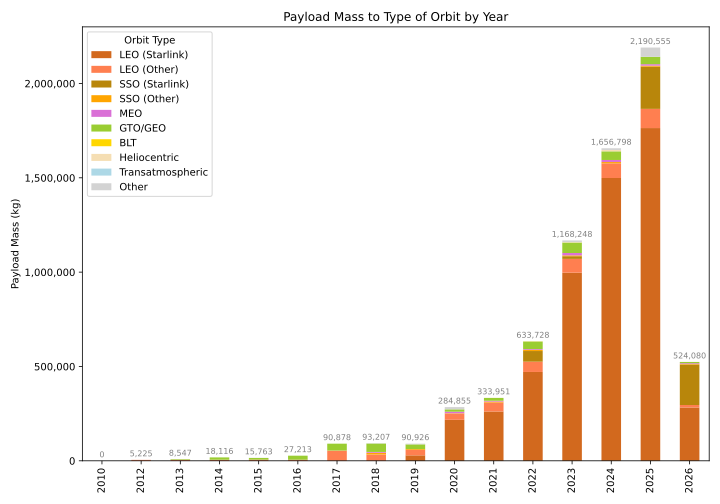
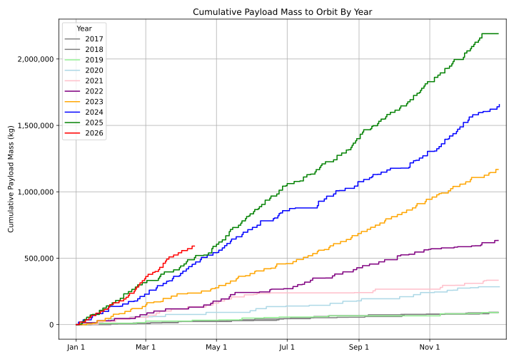

# SpaceX Mass-to-Orbit Graphs

⚠️Currently paused due to [an editorial dispute](https://en.wikipedia.org/wiki/Talk:List_of_Falcon_9_and_Falcon_Heavy_launches#Please_do_not_add_Starlink_masses_when_they're_unknown) on Wikipedia

This project contains a Python script that fetches data about SpaceX launches from Wikipedia, analyzes the payload mass to different orbits over the years, and provides a cumulative sum of the payload mass to orbit.

## Payload Mass to Orbit by Year



## Cumulative Payload Mass to Orbit (2017 onwards)



## Setup and Installation

Make sure you have Python installed on your system. This project was written using Python 3.

To install the required libraries, you'll need to run the following command:

```bash
pip3 install -r requirements.txt
```

Alternatively, you can install the required libraries individually by running:

```bash
pip install requests beautifulsoup4 pandas matplotlib
```

## Running the Script

To generate the analysis graphs, run the following command:

```bash
python3 graphs.py
```

The script will produce two SVG files in the outputs directory if passed the `--output` command line arg:

- `payload_mass_to_orbit_by_year.svg`: A bar chart showing the payload mass sent to various types of orbit by year.
- `cumulative_payload_mass_to_orbit.svg`: A line chart displaying the cumulative payload mass sent to orbit over the span of each year starting from 2017.

Both graphs are also displayed on screen once the script finishes executing.

## Contributing

Contributions are welcome! Please feel free to submit a pull request or create an issue if you have suggestions for improvements.
