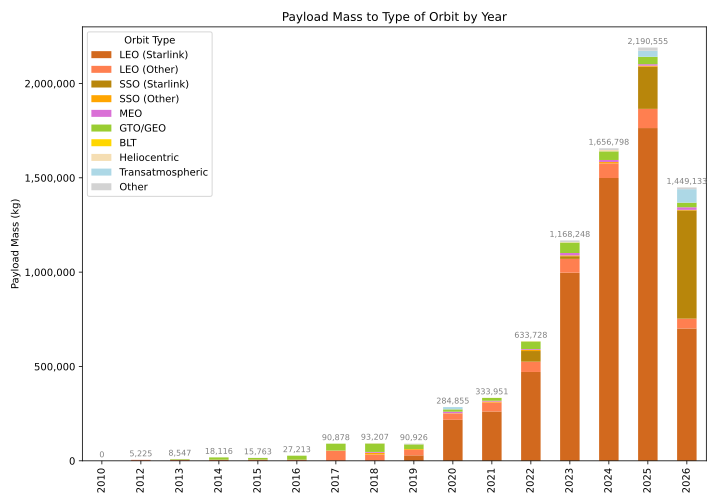
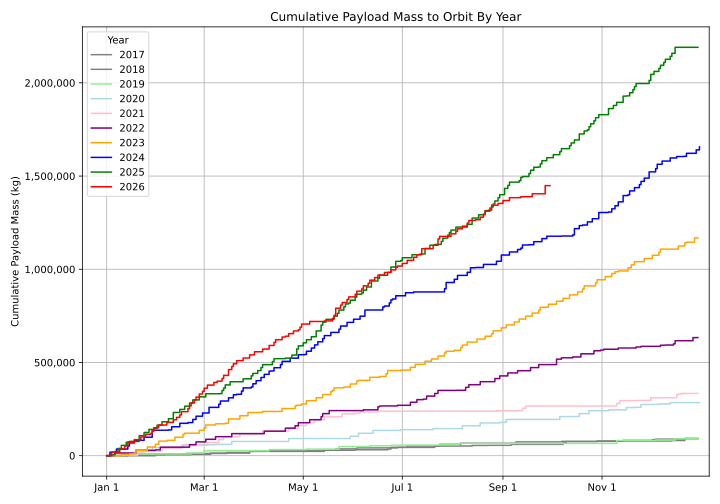

# SpaceX Payload Mass Graphs

This project contains a Python script that fetches data about SpaceX launches from Wikipedia, analyzes the payload mass launched to different destinations over the years, and provides a cumulative sum of the payload mass launched. Suborbital flights, such as Starship test flights carrying Starlink simulators, count as launched mass under the Transatmospheric category.

The scraper reads Wikipedia's year-specific Falcon launch archives as well as the current Falcon and Starship launch pages. The graphs and CSV are derived from those pages, written by Wikipedia contributors and licensed under [CC BY-SA 4.0](https://creativecommons.org/licenses/by-sa/4.0/).

## Payload Mass Launched by Year and Destination



## Cumulative Payload Mass Launched (2017 onwards)



## Running with Docker (recommended)

Docker installs the pinned dependencies for you. You need Docker with Docker Compose.

```bash
docker compose run --rm graphs
```

This fetches the Wikipedia pages and saves the graphs and CSV to `outputs/`. A container has no display, so Docker always saves rather than showing the graphs on screen. To add flags, include `--output` too, as in `docker compose run --rm graphs --output -q`. Downloaded pages are kept in a Docker volume, so later runs only re-download pages that changed.

The container runs as a user with ID 1000. On a Linux host where your user ID differs, run it as your own user so the files it writes in `outputs/` belong to you:

```bash
docker compose run --rm --user "$(id -u):$(id -g)" graphs
```

## Running locally

You need Python 3.11 or newer.

```bash
python3 -m venv .venv
source .venv/bin/activate
pip install -r requirements.txt

# Show the graphs on screen
python3 graphs.py

# Save the graphs and CSV to outputs/
python3 graphs.py --output
```

Add `-q` to print only warnings and errors.

## Outputs

With `--output`, the script writes three files to `outputs/`:

- `payload_mass_to_orbit_by_year.svg`: a stacked bar chart of payload mass launched to each destination by year
- `cumulative_payload_mass_to_orbit.svg`: a line chart of cumulative payload mass launched, from 2017 onwards
- `spacex_launches.csv`: every parsed launch, with its raw and categorized orbit and its outcome. `Payload Mass (kg)` is the mass Wikipedia reports, blank when unknown or classified. `Counted Mass (kg)` is what the graphs sum, which is 0 for failed launches.

Downloaded pages are cached in `.cache/`, and Wikipedia is asked only for pages that changed. If neither the launch data nor the date has changed since the last successful run, the script skips regenerating the outputs.

The run fails with exit code 1, rather than publishing questionable graphs, when a page parses to no launches, a past year has no launches, or Wikipedia can't be reached and the cached pages are more than three days old.

A GitHub Actions workflow runs the script daily and commits any changed outputs, which keeps the graphs above current.

## Project Structure

`graphs.py` is the entry point; the implementation lives in the `spacex_graphs/` package:

- `config.py` — Wikipedia URLs, HTTP settings, orbit-category mapping
- `cache.py` — HTTP caching (ETag/Last-Modified) and change detection
- `parsing.py` — parses launch records from Wikipedia's HTML tables
- `transform.py` — orbit categorization and DataFrame preparation
- `plotting.py` — builds the matplotlib figures
- `output.py` — writes the SVG and CSV files
- `cli.py` — command-line interface and orchestration

## Development

Install the development tools, which include the runtime dependencies:

```bash
pip install -r requirements-dev.txt
```

CI runs these checks on every pull request:

```bash
ruff check .
ruff format --check .
mypy
python3 -m unittest discover -s tests
```

Dependencies are declared in `requirements.in` and `requirements-dev.in` and locked, with hashes, in the matching `.txt` files. To change a dependency, edit the `.in` file and run `scripts/update-locks.sh`; pass `--upgrade` to move everything to the latest releases. CI fails if a lock doesn't match its `.in` file.

Leave regenerating `outputs/` to the scheduled workflow: SVGs rendered on other platforms differ slightly from CI's even for the same data.

## Contributing

Contributions are welcome. [AGENTS.md](AGENTS.md) describes the project's design rules and conventions, for people and coding agents alike: Conventional Commits, rebasing branches rather than merging `main`, and attaching before-and-after renders when a change alters the graphs.
