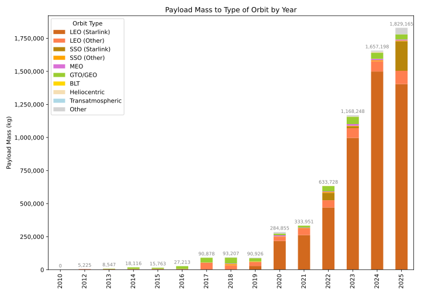
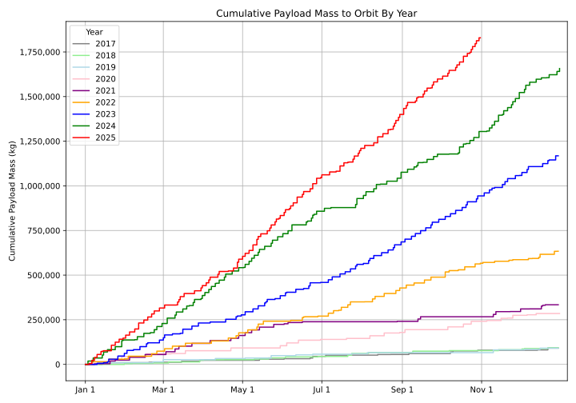

# SpaceX Mass-to-Orbit Graphs

This project contains a Python script that fetches data about SpaceX launches from Wikipedia, analyzes the payload mass to different orbits over the years, and provides a cumulative sum of the payload mass to orbit.

## Payload Mass to Orbit by Year



## Cumulative Payload Mass to Orbit (2017 onwards)



## Setup and Installation

### Option 1: Using Docker (Recommended)

The easiest way to run this project is using Docker, which handles all dependencies automatically.

#### Prerequisites
- Docker and Docker Compose installed on your system

#### Running with Docker

```bash
# Generate graphs and save as SVG files to outputs/ directory
docker compose run graphs --output

# Generate graphs and display on screen (without saving)
docker compose run graphs
```

The Docker container will automatically:
- Install all required dependencies
- Mount the `outputs/` directory for saving generated graphs
- Run the script with your specified arguments

### Option 2: Local Installation

If you prefer to run the script locally, make sure you have Python 3 installed on your system.

To install the required libraries, run:

```bash
pip3 install -r requirements.txt
```

Alternatively, you can install the required libraries individually:

```bash
pip install requests beautifulsoup4 pandas matplotlib
```

## Running the Script

### With Docker

```bash
# Save graphs as SVG files
docker compose run graphs --output

# Display graphs without saving
docker compose run graphs
```

### Without Docker

```bash
# Display graphs on screen
python3 graphs.py

# Save graphs as SVG files to outputs/ directory
python3 graphs.py --output
```

### Output

The script generates two graphs:

- `payload_mass_to_orbit_by_year.svg`: A stacked bar chart showing the payload mass sent to various orbit types by year
- `cumulative_payload_mass_to_orbit.svg`: A line chart displaying the cumulative payload mass sent to orbit starting from 2017

When run with `--output`, the graphs are saved as SVG files in the `outputs/` directory. Without this flag, graphs are displayed on screen.

## Contributing

Contributions are welcome! Please feel free to submit a pull request or create an issue if you have suggestions for improvements.
